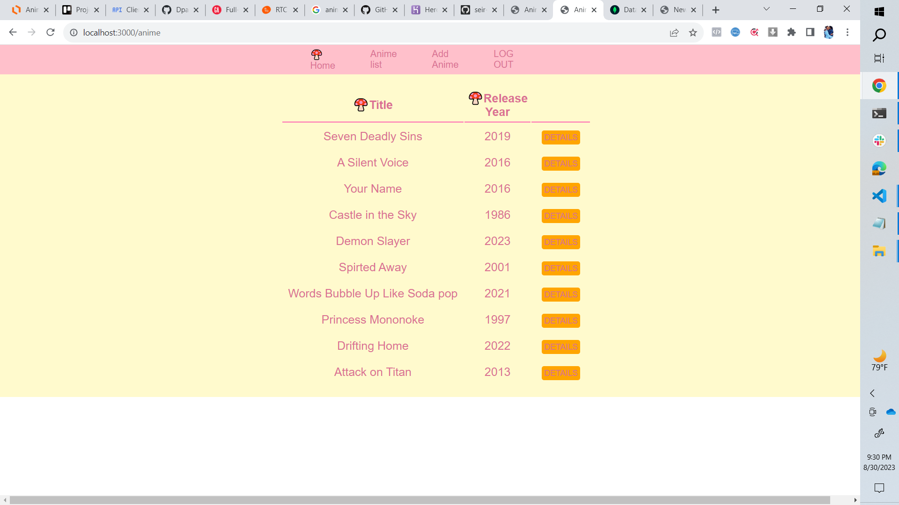

# anime
The App's name is Anime Time.

Introducing "AnimeTime" your ultimate destination for finding a list of anime entertainment where you can add an anime tv show or movie of your choice you can also find a anime tv show or movie off AnimeTime's list with the information about that particular anime Tv show or Movie for example. The Title, release Year, does it show on Netflix, etc... You can also leave a review about that anime to give others a chance to decide if that’s the anime for them. Discover a vast list of anime content from timeless classics to the latest releases. You must be logged in to access AnimeTime. Experience the next level of anime information and reviews with AnimeTime. Download the app now and embark on a journey through the captivating reviews of animation. 

Your future favorite show awaits you.
Acess AnimeTime Here --> :

## The Technologies i Used:
*  MongoDB
*  Mongoose-defined Schemas
*  Express
*  Node.js
*  OAuth and Passport

### Getting Started
[Experience AnimeTime Here](url "alt text")
1. When you click on Anime List you will be sent to this page. where you can check out the Title of the anime and the release year. You can then click on details to get more information on that anime tv or movie.
2.
3. When you would like to add your own anime, you can click on add anime and it will send you to this page, you will then add the information and it will update on the anime list page.
4.
5. If you click on details on the anime list page it will send you here. on this page you can update the anime movie or tv information, you can also leave a review on that paticular movie or tv show. If you decided you would like to get rid of your review you can click on the X button and it will delete your review. 
6.
#### Next Steps (iceBox)
* I would like for on the add anime page streaming on Netflix i made it a boolen so it says true or false i would like to change that so you can add in where excatly that tv show or movie can be streamed at.
* I would like to add more information about that paticular anime on the add anime page.
* I would like to update my reviews so if you post a review you can go back in later and update it
* I would like for the anime list to go in Alphabetical order
* 
